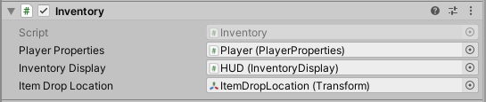
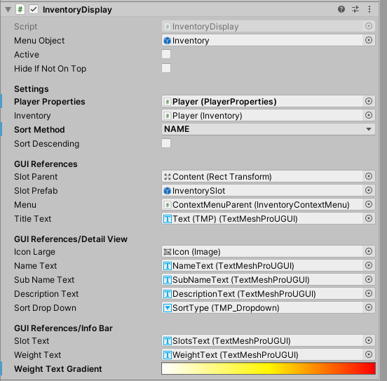

== Inventory module

=== Submodules
link:Inventory.adoc[Inventory class]

link:InventoryDisplay.adoc[InventoryDisplay class]

=== Required Components
* link:Inventory.adoc[Inventory]
	** link:../Player/PlayerProperties.adoc[PlayerProperties]
	** link:InventoryDisplay.adoc[InventoryDisplay]
	** Item Drop Location (Transform)
* link:InventoryDisplay.adoc[InventoryDisplay]
	** link:../Player/PlayerProperties.adoc[PlayerProperties]
	** link:Inventory.adoc[Inventory]
	** Slot Parent (Transform)
	** Slot Prefab (InventorySlot)
	** link:../Menu/InventoryContextMenu.adoc[InventoryContextMenu]
	** Title Text (TMP Text)
	
	** Icon Large (Sprite)
	** Name Text (TMP Text)
	** SubName Text (TMP Text)
	** Description Text (TMP Text)
	** Sort Type (TMP DropDown)
	
	** Slot Text (TMP Text)
	** Weight Text (TMP Text)
	** Weight Text Gradient (Gradient)

=== How it works (code wise)

The Inventory is split into link:Inventory.adoc[Inventory] and link:InventoryDisplay.adoc[InventoryDisplay].

link:Inventory.adoc[Inventory] manages the actual Array of link:InventoryItem.adoc[InventoryItem]s.
This class uses a small amount of logic, most of the methods are delegates to link:InventoryDisplay.adoc[InventoryDisplay].

For every Inventory Item Category there is a subclass of link:InventoryItem.adoc[InventoryItem].
The four attributes `consumable`, `useable`, `equippable` and `droppable` are defined by category by default, but can be adjusted individually.

link:InventoryDisplay.adoc[InventoryDisplay] handles displaying the Inventory as Menu. It uses link:../Menu/CloseableMenu.adoc[CloseableMenu] for main functionality.
After showing the menu, `RefreshDisplay()` is called. This method sorts the Items using the selected sort variable. After sorting the instancing of 
link:InventorySlot.adoc[InventorySlot]s is done by looping through the sorted link:InventorySlot.adoc[InventorySlot] Array from link:Inventory.adoc[Inventory].

_Please note, that `RefreshDisplay()` has to be called after changing the player inventory contents in order to show the new contents, or errors might occur._

Inventory sorting can be adjusted by changing `sortMethod` in link:InventoryDisplay.adoc[InventoryDisplay]. Default sorting is `ascending`. Please set `sortDescending` to `true` to change this.

==== Interaction with environment

Picking up items can be done by calling `Pickup(link:InventoryItem.adoc[InventoryItem] item)`, from an link:../Interaction/Interactable.adoc[Interactable] or any other script.

Dropping items teleports the GameObject of the attached link:InventoryItem.adoc[InventoryItem] to the ItemDropLocation Transform position and enables it there, before removing it from the Inventory.

=== How to add Inventory to a new scene

To add the InventorySystem to a new scene, do the following:

1. Attach link:Inventory.adoc[Inventory] to the Player GameObject. Make sure, all references are set.

2. Attach link:InventoryDisplay.adoc[InventoryDisplay] to the HUD-Canvas. Make sure, all references are set. 

