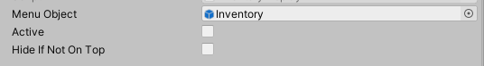

=== Responsibility

This class is a base class for all menus, that can be closed, for example Inventories, PauseMenus and Dialogs.

It features menu-stacking, which makes a complex menu navigation easy and quick to implement. When a new menu is opened, it will be added
to the Stack of opened menus. Pressing `ESC`, or calling `Hide()` on any menu will cause the top menu to close first.

Subclasses of this script can be used to create new menues.

_Please make sure to override `Show()` and `Hide()`, and include `base.Show()` and `base.Hide()` respectively in the overridden methods._

=== How to create a new menu

* Create a new Script, and add `CloseableMenu` as upper class: `public class MyNewMenu : CloseableMenu`

* Override `Show()`, `Hide()` and (optionally) `Toggle()`:
[source,c-sharp]
----
public class MyNewMenu : CloseableMenu

    public override void Show()
    {
        base.Show();
        [...]
    }
    
    public override void Hide()
    {
        base.Hide();
        [...]
    }
----

* Attach your new script to the parent object of your menu canvas. `Important: The script cannot be attached to the GameObject, that is supposed to be disabled, because it cannot be enabled again`.

* Reference your menu GameObject under `Menu Object`

