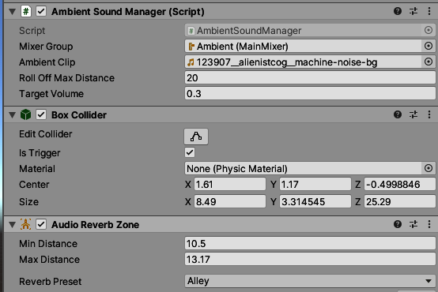

= Ambient Sound

Ambient Sounds are sounds, that are at a fixed position in the game world and play 'background' sounds.
They are controlled by `AmbietSoundManager`.

== How to setup an Ambient Sound?

Like a link:SoundArea.adoc[Sound Areas] they are need to an empty game object. This should be in the folder `Areas`.

image::images/areas_scene_view.png[Areas in Scene View]

=== Components

After that you need to add some components to the object.

First you need to add the `Ambient Sound Manager` Script. Than you need to add the `MixerGroup`, the sounds should be
routed through.
This should be the `Ambient` from the `MainMixer`. Next you can add a `AudioClip`. This is the background noise which is
coming from the center of the area.
There are two parameter which control the reverb zone.

1. `Roll Off Max Distance`: is the distance from which the back ground noise will be heart.
2. `Target Volume`: This can be a value in `[0, 1]`. It's recommended to lower values for background sounds.

Next you need to add any collider(s). This is necessary for registering the player entering the sound. `Is Trigger` must
be checked. Resize the collider(s) to the zone you intend any reverb effect should be used.

After that one more component is required. The `Audio Reverb Zone` will change any sound (with the exception of music) 
so it appears it will be played at a special location. This could be an open area, concert halls or small rooms. You
could use a predefined preset or create one of your own with the `user` preset.