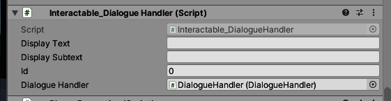

= Dialogue

== How add sound to dialogues?

=== Components

First you need a `Interactable_Dialogue_Handler`.

The most important part is, to add the `DialogueHandler` which should appear automatically if you click the target button
on the right.

Next you need to add `CharacterSound` from `Sounds.Manager`

image::character-sound-manager.png[]

For the dialogue you can neglect the `Sound Clips` as they will be set by default. But you have to set
the two mixers, which should also appear automatically upon clicking the target button.

=== Audio Clips

You need to add the audio files under `Assets/Resources/CHARACTER/` where `CHARACTER` is the name of the character.

_If you have trouble importing audio files, try to convert them to `.wav`._

Next you need to add them to the database. In the test this is done by adding an empty `GameObject` and than adding
the component `DBTest`. *Really important, after you're done, remove this object.*

Next the files must be loaded into the database. Open `Assets.Scripts.Databse.DBTest.cs` and add the following line for 
each clip:

[source,c-sharp]
----
dialogueClipDb.AddData(new DialogClip($"CHARACTER/FILE", ID, LINE_ID));
----

where: 

- CHARACTER: is the character name, see above
- FILE: the file name without extension
- ID: the id of the audio clip. Please check the other code in that file, so there are no duplications.
- LINE_ID: the id of the dialogue line, which should be already be loaded to the database and you could look it up above.