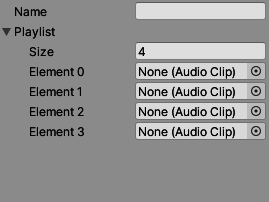

= Playlist

== How to setup a playlist?

In the editor navigate to `Assets/Playlists/`. Right-click in the folder and select `Create -> ScriptableObjects -> PlaylistScriptable`.
You need to enter a `Name`, which must be unique, and a `Size` which is the number of tracks in the list. This can be changed later on.

Now you can add all the tracks as `Audio Clip`.