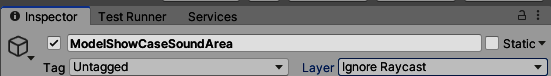
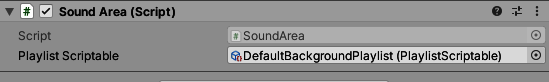

= Sound Areas
:icons: font

== Why use `Sound Areas`?

`Sound Areas` are useful for closed rooms to create special effects and/or isolate outside sounds.

== How to setup a `Sound Area`

In order to add a sound area to your scene, create a empty object in the `Areas` folder.

image::images/areas_scene_view.png[Areas in Scene View]

=== Components

Than you need to add a box collider which is at least as high the max. position of the player's feet box collider.
It also must be set to `Is Trigger`.

[WARNING]
In order to prevent raycast blocking the sound area must be in `Ignore Raycast`-Layer.

=== Script

You need to add a `Sound Area` script as component.

The only attribute is a `PlaylistScriptable`, where you can load a predefined link:Playlist.adoc[playlist].