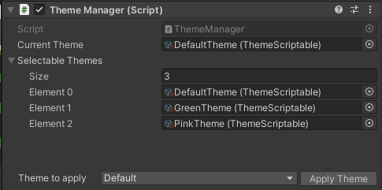
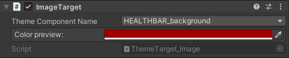

== Theme module

=== Submodules
link:ThemeManager.adoc[Theme Manager class]

link:ThemeTarget.adoc[Theme Target class]

link:Theme.adoc[Theme scriptable class]

=== Background

Themes are for UI Customization. Many graphical aspects will be changed throughout the development of the project. To not hardcode colors and material I decided to create this Theme Manager for easier and central access of all colors. This place for central color choosing will now be referred to as link:Theme.adoc[Theme].

Combining all Debug-UI elements in one group, all menu backgrounds in one group, etc. will be very useful for quick style adjustments.
Furthermore the support for Color blindness will be made easier by Themes.

=== How it works

A link:Theme.adoc[Theme] is a scriptable asset with a `name` and a variable amount of `Theme Components`. Each `ThemeComponent` has their own unique `name` and `Color`. Each Theme Component represents a `Theme Group` for easier use of colors.

image::images/Theme.png[Theme scriptable view]

Every UI-Element needs to have a `link:ThemeTarget.adoc[ThemeTarget]` attached. There are multiple subclasses for `link:ThemeTarget.adoc[ThemeTarget]`, which are fit to the representing UI-Element, for example `Image`, `Button` and `Text`. After adding the `link:ThemeTarget.adoc[ThemeTarget]`, the developer can choose the fitting `Theme Component` to inherit from. The link:ThemeTarget.adoc[ThemeTarget] will automatically stay up to date with the current theme and will take the color of their respective `Theme Component`. 

_Note: Multiple UI-Elements can use the same `Theme Component`. An example for this is the debug screen and crosshair using `UI_crosshair`._

=== How it works (code wise)

The Theme functionality is split into link:ThemeManager.adoc[ThemeManager] and link:ThemeTarget.adoc[ThemeTarget].

link:ThemeManager.adoc[ThemeManager] manages all available link:Theme.adoc[Theme]s and is the central script to change the active link:Theme.adoc[Theme]. link:Theme.adoc[Theme]s are `ScriptableObjects` in the project view. Creating a new link:Theme.adoc[Theme] can be done by navigating to `Assets -> Create -> Theme -> New Theme`.

When changing the active link:Theme.adoc[Theme], the link:ThemeManager.adoc[ThemeManager] will call `Refresh()` on all active link:ThemeTarget.adoc[ThemeTarget]s. Inactive ones will `Refresh()` themselves when enabled.

=== How to add Themes to a new scene

To add the Theme functionality to a new scene, do the following:

. Create a new instante of link:Theme.adoc[Theme] and create the needed `Theme components` with colors.
For example: `UI_background`, `button_normal`, `menu_button_highlighted`

image::images/Theme.png[Theme scriptable view]

. Attach the link:ThemeManager.adoc[ThemeManager] to any objects, preferable the HUD. Make sure to insert an active link:Theme.adoc[Theme] and (optionally) more scenes in the `Selectable link:Theme.adoc[Theme]s` Array.
 

. Attach the link:ThemeTarget.adoc[ThemeTarget] to every UI-Element with link:Theme.adoc[Theme] functionality. There are many subclasses of `link:ThemeTarget.adoc[ThemeTarget]` to be used - for example `ImageTarget` for Images, `ButtonTarget` for Buttons and Toggles.

. Select `Theme Component Name` to select the group for the link:ThemeTarget.adoc[ThemeTarget]. The link:ThemeTarget.adoc[ThemeTarget] will automatically get the color values from the selected link:Theme.adoc[Theme].
